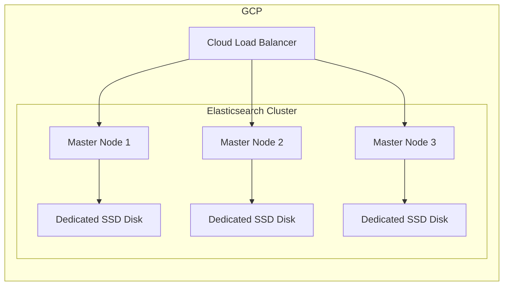

# Elasticsearch Cluster Architecture

The solution is hosted on Google Cloud Platform (GCP), utilizes Cloud Load Balancer to distribute traffic, ensures seamless request routing to active nodes.

Elasticsearch Cluster: 
- Comprises three master nodes for high availability, tolerates node failures without downtime.
- Each master node has a dedicated SSD for efficient storage.
- Performance: SSDs provide high I/O performance and low latency.

