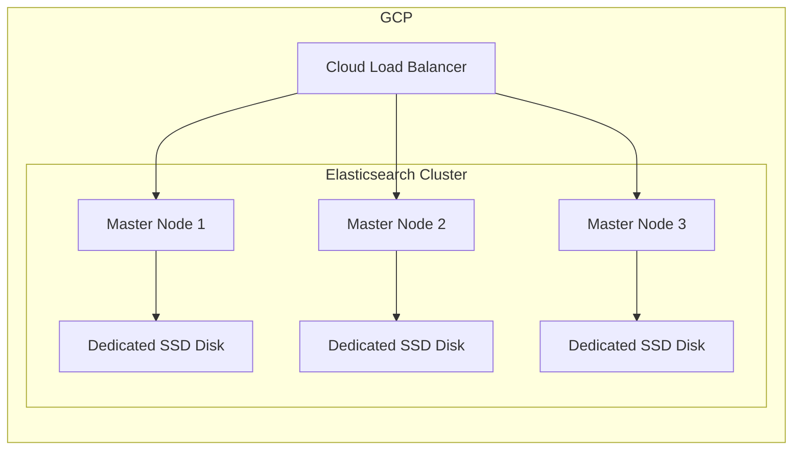

# Elasticsearch Cluster Architecture

Provider node: `ges-ldap-01` (read & write)

Consumer nodes: `ges-ldap-02`, `ges-ldap-03` (read-only)

Replication is asynchronous, for every 100 operations or 10 minutes, which ever is sooner.

