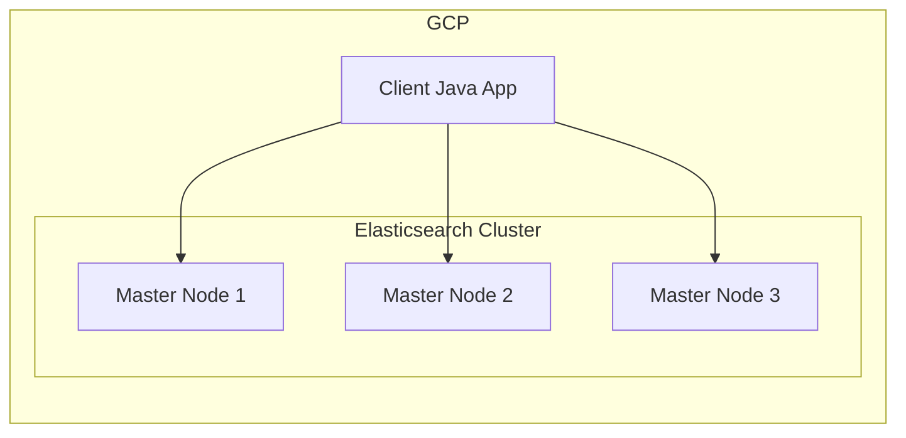

# Highly Available Authenticated Elasticsearch Cluster on GCP

## Architecture Diagram


## Choice of Tech Stack:
- **Operating System:** Debian 12
- **Containerization:** Docker for deployment
- **Storage:** 100GB of Balanced persistent disks (pd-balanced) for data storage
- **Security:** TLS for secure communication and Basic Authentication for user access
- **Elasticsearch Version:** 8.15.3

## Actual Solution:

### Local DEV Environment
1. **Configure TLS**

   There are 2 verification modes for SSL:
   - certificate: Only validates that the certificate is signed by a trusted Certificate Authority (CA).
   - full: Performs a full validation, which includes checking the hostname against the certificate.

   For this demo setup, we will choose full verification mode:
   - Generate SSL certificates for each Elasticsearch node using the provided `ca.crt` and `ca.key` files.
   - Utilize [elasticsearch-certutil](https://www.elastic.co/guide/en/elasticsearch/reference/current/certutil.html#certutil-cert) to create the cert bundle:
      ```
      docker run --rm -v $(pwd)/certs:/certs docker.elastic.co/elasticsearch/elasticsearch:8.15.3 \
      bin/elasticsearch-certutil cert \
      --ca-cert /certs/ca.crt --ca-key /certs/ca.key \
      --pem --in /certs/instance.yml \
      --out /certs/bundle.zip
      ```

2. **Deploy Elasticsearch Cluster:**
   - Use the official Elasticsearch Docker image for version **8.15.3**.
   - Run the `dev.docker-compose.yml` file.

3. **Verify Elasticsearch Cluster:**
   - Verify SSL.
   - Verify Index sharding config.
   - Manually shutdown 1-2 nodes to test high availability, node failures tolerance capability.

### GCP PRD Environment
1. **Infra Setup:**
   - Set up **three `n1-standard-1`** nodes (vCPUs: 1, RAM: 3.75 GiB)
   - For each VM instance:
      - Install docker + docker-compose
      - Create data dir `/data/`
      - Create config dir `/opt/elasticsearch/`
      - Mount SSD Disk to `/data` mountpoint
      - Give docker user permission to access directories.

2. **Configure TLS**
   - Copy the certificates from local dev env to `/opt/elasticsearch/certs`
   - Cert files are read-only (600)
   - Docker user has read permission

3. **Deploy Elasticsearch:**
   - Modify the `prd.docker-compose.yml` and copy to each node.
   - Run with `docker compose up -d`

4. **Connect to the cluster**
   - Hypostatically the Client app is Java Springboot, and all libraries are installed, this is the example application.yaml:
   ```yaml
   spring:
      elasticsearch:
         rest:
            uris:
            - https://elasticsearch-node-1.example.com:9200
            - https://elasticsearch-node-2.example.com:9200
            - https://elasticsearch-node-3.example.com:9200
            username: your_username
            password: your_password
            connection-timeout: 5s
            read-timeout: 10s
         ssl:
            enabled: true
            certificate: classpath:client-cert.pem
            certificate-key: classpath:client-key.pem
            trusted-certificates: classpath:ca-cert.pem
   ```

4. **Cost Management:**
   - The above setup will cost roughly $100/ month , prices vary by geographical region.
   - Given the benefit of new GCP account with $300 free credit. We will able to maintain the cluster for 6 months with $300 budget.
   - Regularly monitor GCP usage to ensure it stays within the budget. Utilize GCP pricing calculators to estimate costs for VM instances and storage.

>Note 1: `n1-standard-1` is not recommened for any **real** production system.  
>Note 2: `Spot instance` is cheaper but not SLA-guaranteed by GCP.

## Time Spent:
- **Planning and Research:** 2 hours
- **DEV Setup and Configuration:** 3 hours
- **PRD Setup and Configuration:** 2 hours
- **Testing and Validation:** 2 hours
- **Documentation:** 3 hours
- **Total Time:** Approximately 12 hours

## Optional:
- **Cloud Load Balancer** To distribute traffic, ensures seamless request routing to active nodes.
- **Monitoring:** Grafana, Prometheus, Loki for monitoring and logging visualization.
- **Backup:** Snapshot functionality of GCP Persistent Disks